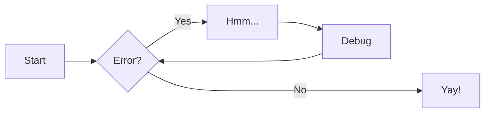
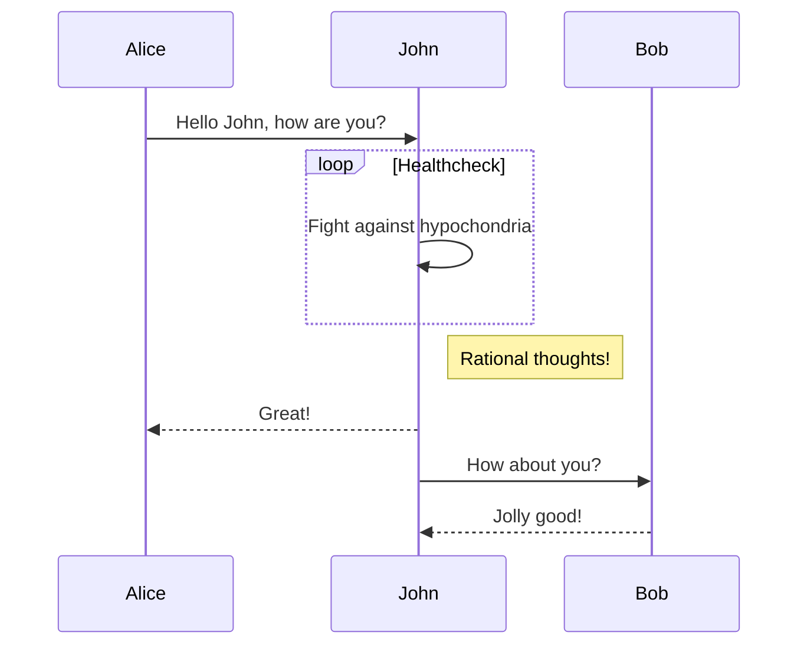
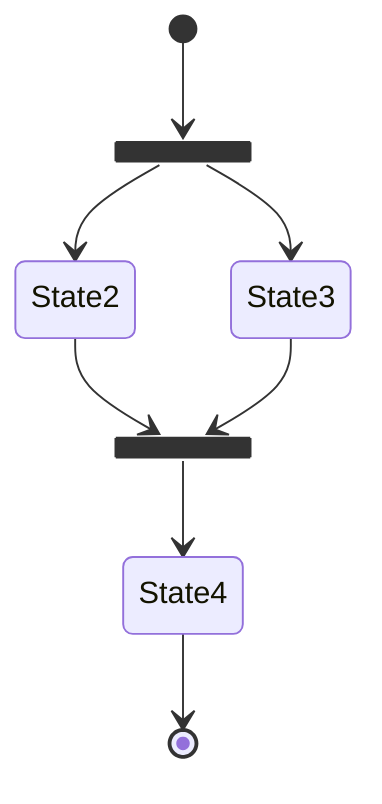
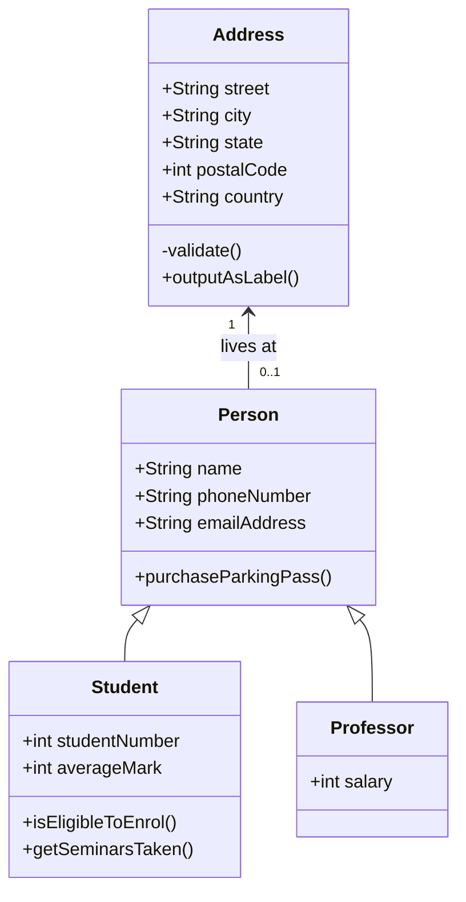
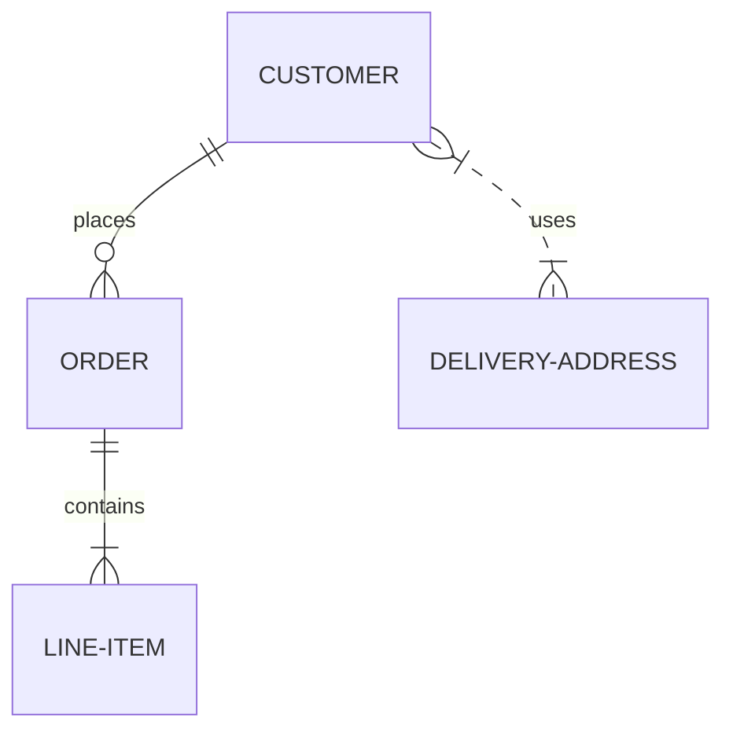

# Diagrams

Diagrams help to communicate complex relationships and interconnections between
different technical components, and are a great addition to project
documentation. Material for MkDocs integrates with [Mermaid.js], a very
popular and flexible solution for drawing diagrams.

[mermaid.js]: https://mermaid-js.github.io/mermaid/

## Usage

### Using Flowcharts

[Flowcharts] are diagrams that represent workflows or processes. The steps
are rendered as nodes of various kinds and are connected by edges, describing
the necessary order of steps:

````markdown title="Flow chart"

````

_Result:_


[flowcharts]: https://mermaid-js.github.io/mermaid/#/flowchart

### Using Sequence Diagrams

[Sequence diagrams] describe a specific scenario as sequential interactions
between multiple objects or actors, including the messages that are exchanged
between those actors:

````markdown title="Sequence diagram"

````

_Result:_


[sequence diagrams]: https://mermaid-js.github.io/mermaid/#/sequenceDiagram

### Using State Diagrams

[State diagrams] are a great tool to describe the behavior of a system,
decomposing it into a finite number of states, and transitions between those
states:

````markdown title="State diagram"

````

_Result:_


[state diagrams]: https://mermaid-js.github.io/mermaid/#/stateDiagram

### Using Class Diagrams

[Class diagrams] are central to object oriented programing, describing the
structure of a system by modelling entities as classes and relationships between
them:

````markdown title="Class diagram"

````

_Result:_


[class diagrams]: https://mermaid-js.github.io/mermaid/#/classDiagram

### Using Entity-Relationship Diagrams

An [entity-relationship diagram] is composed of entity types and specifies
relationships that exist between entities. It describes inter-related things in
a specific domain of knowledge:

````markdown title="Entity-relationship diagram"

````

_Result:_


[entity-relationship diagram]: https://mermaid-js.github.io/mermaid/#/entityRelationshipDiagram
