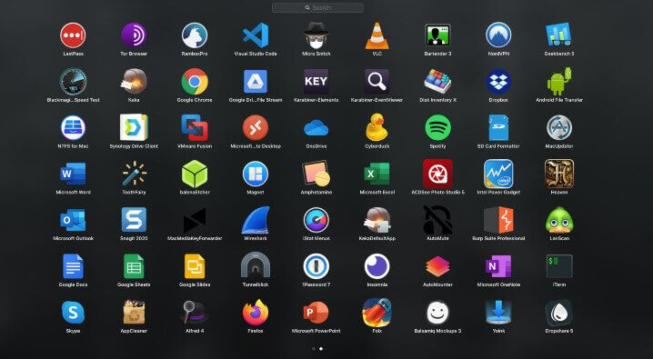

# UI Tweaks

## Hide All The Icons On Your Desktop

Disable Icons:

```bash
defaults write com.apple.finder CreateDesktop false
killall Finder
```

Enable Icons:

```bash
defaults write com.apple.finder CreateDesktop true
killall Finder
```

## Change the Launchpad Grid Layout

<div style="width:90%; margin:0 auto">
    
</div>

Change the _springboard-columns_ and _springboard-rows_ values according to your preference

```bash
defaults write com.apple.dock springboard-columns -int 8
defaults write com.apple.dock springboard-rows -int 6
defaults write com.apple.dock ResetLaunchPad -bool TRUE
killall Dock
```

## Reset Launchpad Icons Sort

```bash
defaults write com.apple.dock ResetLaunchPad -bool true; killall Dock
```

## Set the `Same View Options` for all Finder windows

First, we want to set the default view options for all new Finder windows. To do so, open Finder and click on the view setting that you want to use. The settings are four icons and the top of your Finder window.
If you don't see the Finder toolbar type:

```bash
cmd + option + t
```

After selecting the option you want, type:

```bash
cmd + j
```

to open the view options window.

Make sure you check the top two checkboxes that say Always open in list view and Browse in list view. Keep in mind it will reflect whichever view you've selected.

Now click the button at the bottom that says "Use as Defaults".

### Delete all .DS_Store files on your computer

Chances are you've opened some Finder windows in the past. Individual folder options will override this default setting that we just set.

In order reset your folder settings across the entire machine we have to delete all .DS_Store files. This will ensure that all folders start fresh. Open up the Terminal application (Applications/Utilities/Terminal), and type:

```bash
sudo find / -name .DS_Store -delete 2>/dev/null ; killall Finder
```

`Note: In the future, whenever you switch views, it will automatically save in the new .DS_Store file. This will override the default settings.`
