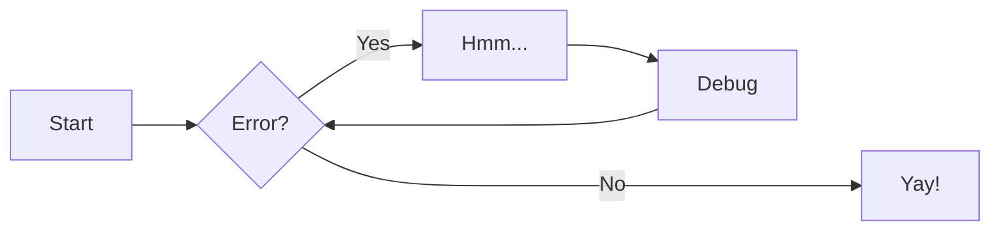
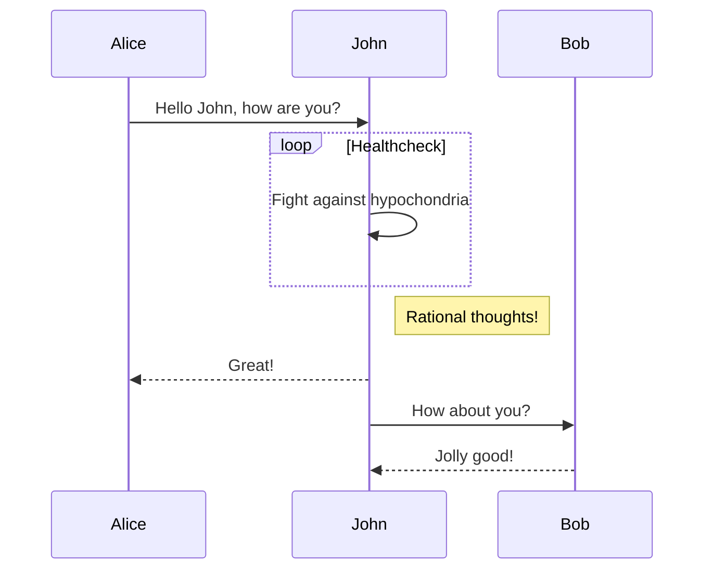
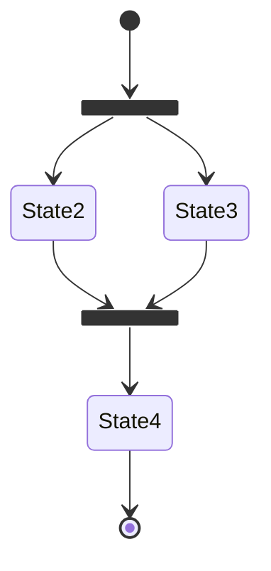
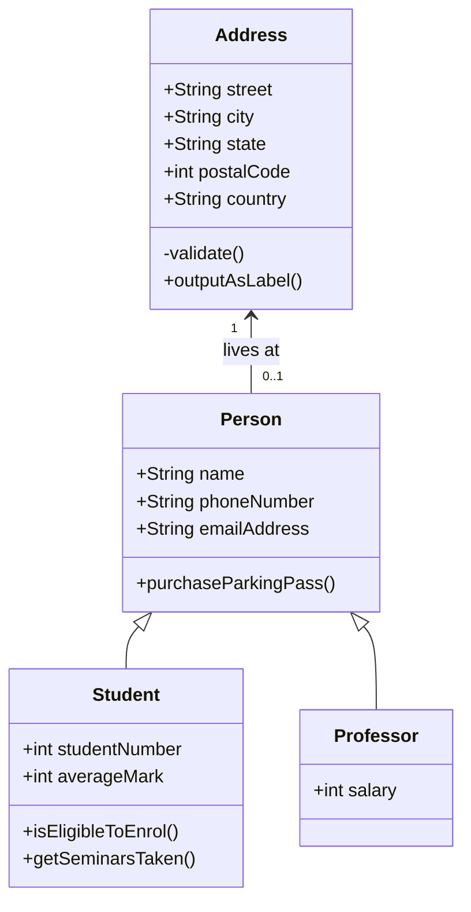
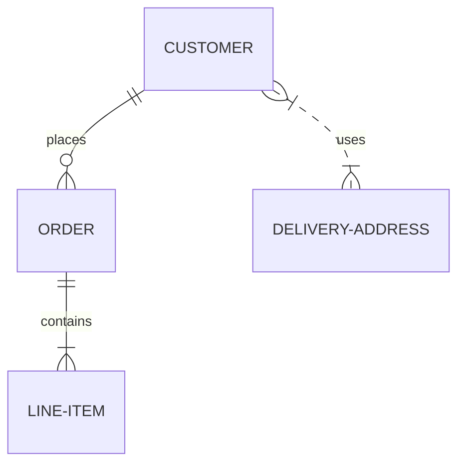

# Mermaid Diagrams

Diagrams help to communicate complex relationships and interconnections between
different technical components, and are a great addition to project
documentation. Material for MkDocs integrates with [Mermaid.js][mermaid.js-url]{target=\_blank}, a very
popular and flexible solution for drawing diagrams.

## Usage

### Using Flowcharts

[Flowcharts][flowcharts-url]{target=\_blank} are diagrams that represent workflows or processes. The steps
are rendered as nodes of various kinds and are connected by edges, describing
the necessary order of steps:

````markdown title="Flow chart"

````

_Result:_


### Using Sequence Diagrams

[Sequence diagrams][sequence-diagrams-url]{target=\_blank} describe a specific scenario as sequential interactions
between multiple objects or actors, including the messages that are exchanged
between those actors:

````markdown title="Sequence diagram"

````

_Result:_


### Using State Diagrams

[State diagrams][state-diagrams-url]{target=\_blank} are a great tool to describe the behavior of a system,
decomposing it into a finite number of states, and transitions between those
states:

````markdown title="State diagram"

````

_Result:_


### Using Class Diagrams

[Class diagrams][class-diagrams-url]{target=\_blank} are central to object oriented programing, describing the
structure of a system by modelling entities as classes and relationships between
them:

````markdown title="Class diagram"

````

_Result:_


### Using Entity-Relationship Diagrams

An [entity-relationship diagram][entity-relationship-diagram-url]{target=\_blank} is composed of entity types and specifies
relationships that exist between entities. It describes inter-related things in
a specific domain of knowledge:

````markdown title="Entity-relationship diagram"

````

_Result:_


<!-- appendices -->

[mermaid.js-url]: https://mermaid-js.github.io/mermaid/ 'Mermaid.js'
[flowcharts-url]: https://mermaid-js.github.io/mermaid/#/flowchart 'Mermaid.js Flowcharts'
[sequence-diagrams-url]: https://mermaid-js.github.io/mermaid/#/sequenceDiagram 'Mermaid.js Sequence Diagrams'
[state-diagrams-url]: https://mermaid-js.github.io/mermaid/#/stateDiagram 'Mermaid.js State Diagrams'
[class-diagrams-url]: https://mermaid-js.github.io/mermaid/#/classDiagram 'Mermaid.js Class Diagrams'
[entity-relationship-diagram-url]: https://mermaid-js.github.io/mermaid/#/entityRelationshipDiagram 'Mermaid.js Entity-Relationship Diagrams'

<!-- end appendices -->
