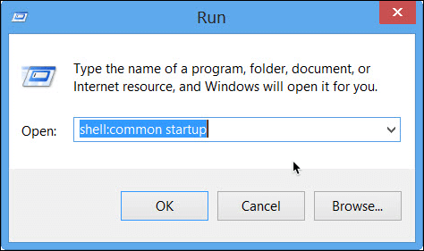

# Snippets

## Add Program to Startup - Windows 7,8,10 & Servers

Hit WIN+R or from start menu search `run` and press enter.  
At run dialog enter `shell:common startup`:



* Create shortcut for the program you want to auto startup when Windows boots.
* Move the shortcut to the `Startup` folder that opened before.

## Reboot or Shutdown Windows From Command Line (CMD)

Reboot windows computer
This command will set a time out of 10 seconds to close the applications. After 10 seconds, windows reboot will start.

```cmd
shutdown /r /t 10
```

Force reboot

```cmd
shutdown /r /f /t 0
```

Force Shutdown

```cmd
shutdown /s /f /t 0
```

