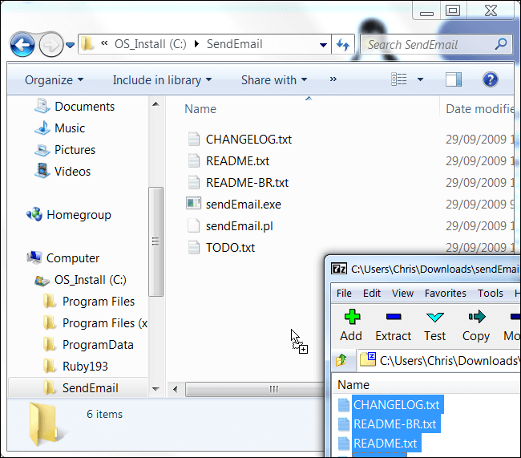
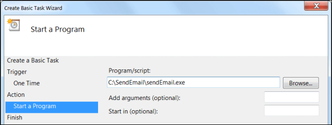
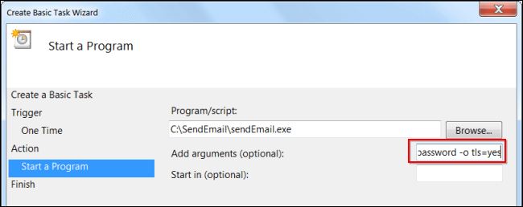

# Windows Guides and How-To

## Declare Locations as "Inside Your Local Network"

!!! warning
    The Intranet Zone is the most trusted and least protected zone. DO NOT put any subnets or IP addresses in this zone unless they are TOTALLY under YOUR control. That includes ANY public server, web site, subnet, or IP address.

* Select 'Control Panel'/'Internet Properties'/'Security' tab. (Alternatively, open Internet Explorer and select 'Tools'/'Internet Options'/'Security' tab.)

* Highlight 'Local Intranet' and click 'Sites'.

* Set the following: Uncheck 'Automatically detect intranet network'.Check 'Include all local (intranet) sites not listed in other zones'.Uncheck 'Include all sites that bypass the proxy server'.Check 'Include all network paths (UNCs)'.​

* Click 'Advanced'

* Uncheck 'Require server verification (https:) for all sites in this zone'.

* In the field labeled 'Add this web site to the zone:', add your local, private subnet using an asterisk for a network mask and click 'Add'. E.g. If your home (local) network is 192.168.25.0 with a mask of 255.255.255.0, enter '192.168.25.*' (without the quotes).

!!! note
    Entries can be:​

    * Individual IP addresses (e.g. '192.168.5.25', etc.),
    * Class C subnets (e.g. '192.168.27.*'),
    * Class B subnets (e.g. '172.16.*.*'), or
    * Class A subnets (e.g. '10.*.*.*')​

You can add as many addresses as you need to the list
It can be handy add the address of a VPN subnet to the list if it is also private and you TOTALLY trust it.​

* Close out with 'Close'/'OK'/'OK' and close the Control Panel (or Internet Explorer).

## Add Program to Startup - Windows 7,8,10 & Servers

Hit WIN+R or from start menu search `run` and press enter.  
At run dialog enter `shell:common startup`:


* Create shortcut for the program you want to auto startup when Windows boots.
* Move the shortcut to the `Startup` folder that opened before.

## Reboot or Shutdown Windows From Command Line (CMD)

Reboot windows computer
This command will set a time out of 10 seconds to close the applications. After 10 seconds, windows reboot will start.

```cmd
shutdown /r /t 10
```

Force reboot

```cmd
shutdown /r /f /t 0
```

Force Shutdown

```cmd
shutdown /s /f /t 0
```

## Send Emails From The Windows Task Scheduler

First, [download SendEmail](https://github.com/fire1ce/sendEmail-windwos-v1.56/archive/master.zip "SendEmail"), a free (and open source) tool for sending emails from the command line. Extract the downloaded archive into a folder on your computer.



Next, launch the Windows Task Scheduler and create a new task – consult our guide to creating scheduled tasks for more information. You can create a task that automatically sends an email at a specific time or a task that sends an email in response to a specific event.

When you reach the Action window, select Start a program instead of Send an e-mail.


In the Program/script box, use the Browse button and navigate to the SendEmail.exe file on your computer.



Finally, you’ll have to add the arguments required to authenticate with your SMTP server and construct your email. Here’s a list of the options you can use with SendEmail:

### Server Options

> * -f EMAIL – The email address you’re sending from.  
> * -s SERVER:PORT – The SMTP server and port it requires.  
> * -xu USERNAME – The username you need to authenticate with the SMTP server.  
> * -xp PASSWORD – The password you need to authenticate with the SMTP server.  
> * -o tls=yes – Enables TLS encryption. May be necessary for some SMTP servers.  

__If you’re using Gmail’s SMTP servers, these are the server options you’ll need:__

> * -s smtp.gmail.com:587 -xu you@gmail.com -xp password -o tls=yes

Of course, you’ll have to enter your own email address and password here.

### Destination Options

> * -t EMAIL – The destination email address. You can send an email to multiple addresses by including a space between each address after the -t option.  
> * -cc EMAIL – Any addresses you’d like to CC on the email. You can specify multiple addresses by placing a space between each email address, just as with the -t command above.  
> * -bcc EMAIL – The BCC version of the CC option above.  

### Email Options

> * -u SUBJECT – The subject of your email  
> * -m BODY – The message body text of your email.  
> * -a ATTACHMENT – The path of a file you’d like to attach. This is optional.  

For example, let’s say your email address is you@gmail.com and you’d like to send an email to person@example.com. You’d use the following options:

```cmd
-f you@gmail.com -t person@example.com -u Subject -m This is the body text! -s smtp.gmail.com:587 -xu you@gmail.com -xp password -o tls=yes
```

Once you’ve put together your options, copy and paste them into the Add arguments box.



Save your task and you’re done. Your task will automatically send email on the schedule (or in response to the event) you specified.
